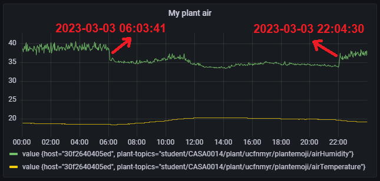
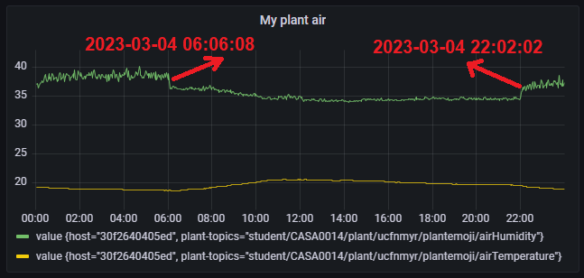
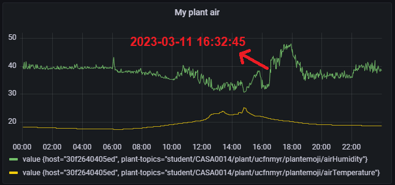
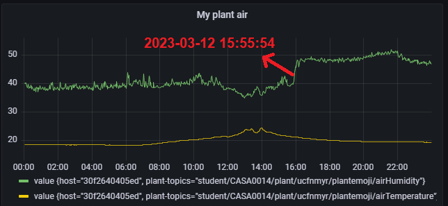
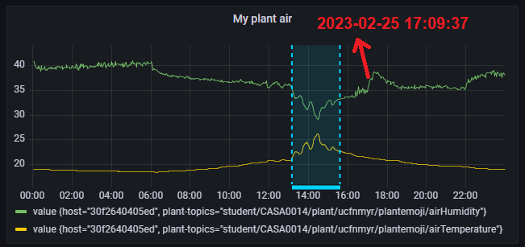
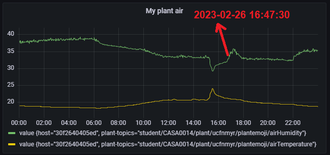
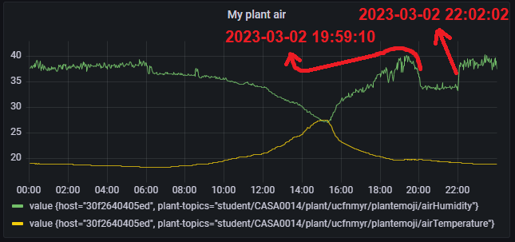

## **A daily sudden decrease and increase in humidity (green).**

This pattern is more clear during weekends.

**My hypothesis:** This pattern probably happens when the AC is turned on and off.

 

Figure 1: Air humidity and temperature readings on Friday, 3-3-2023

 

Figure 2: Air humidity and temperature readings on Saturday, 4-3-2023

 

## A sudden increase in humidity after sunlight exposure

This pattern happens sometimes after the sun has affected the environment by rising the temperature and lowering humidity. Of course, I ensured that the yellow line (temperature) corresponded with sunlight from my UV readings. 

**My hypothesis:** Could the AC be reacting to the sudden increase in temperature by working in cooling mode? 

If this is not the case, my other hypothesis could be related to false readings from the DHT22 I'm using, it may need recalibration after being affected by direct sunlight.

Figure 3: Air humidity and temperature readings on Saturday, 11-3-2023

 

Figure 4: Air humidity and temperature readings on Sunday, 12-3-2023

 

Figure 5: Air humidity and temperature readings on Saturday, 25-2-2023

 

 

Figure 6: Air humidity and temperature readings on Sunday, 26-2-2023

 

Figure 7: Air humidity and temperature readings on Thursday, 2-3-2023. **Note:** The right timestamp is probably related to the AC being turned off.

 

## Discussion with Will about the previous results

These are good graphs and seem to show a useful pattern and give insight to the AC operation as you say. It can’t hurt to recalibrate the sensor, so go ahead with that if you’re worried about errors. Generally, though, I think that you have a good insight of what is going on. One think that I would be wary of though is that you mention your sensors are exposed to direct sunlight. Normally you would put temperature sensors away from windows where they might be affected by direct sunlight to assess room conditions. As your sensor is meant for plant health monitoring, if your plant is in the sun, it might make sense to measure the temperature there, but now that you are using it to make assessments of building systems, I would avoid placing sensors in locations where they could be exposed to direct sunlight where possible.